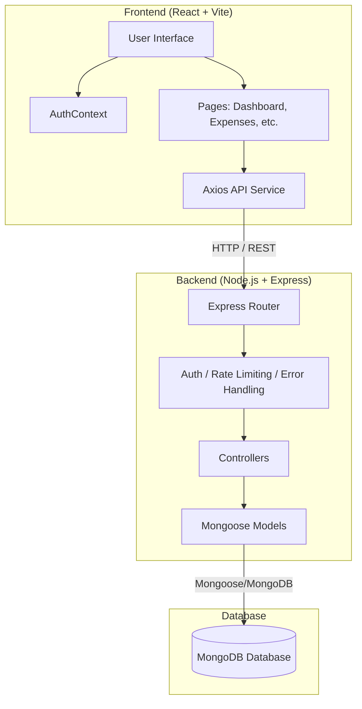
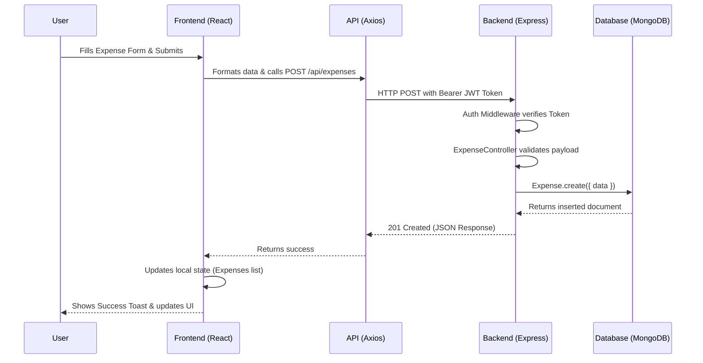

# FinTrack Codebase Walkthrough & Architecture

Welcome to the FinTrack project! This document provides a comprehensive overview of the entire codebase, its architecture, and the data flow. FinTrack is an Enterprise Finance Management System built on the MERN (MongoDB, Express, React, Node.js) stack.

> [!NOTE]
> This walkthrough covers the architecture, backend models, frontend structure, and the core data flow of the application.

## 🏗️ High-Level Architecture

The project follows a standard decoupled client-server architecture.

## 📂 Backend Overview (Node.js + Express)

The backend is a RESTful API serving the frontend. It is located in the `backend/` directory.

### Core Technologies
- **Express.js**: Web framework for handling HTTP requests.
- **Mongoose**: ODM for MongoDB to define structured data models.
- **JWT (JSON Web Tokens)**: Used for stateless user authentication.
- **Security Middleware**: `helmet` for HTTP headers, `express-rate-limit` to prevent brute-force attacks.

### Key Directories
- **`models/`**: Defines the data schema.
  - `User.js`: Handles profile data, password hashing (`bcryptjs`), and JWT generation.
  - `Expense.js`: Tracks expenditures, categories, amounts, and whether they are recurring.
  - `Income.js`: Tracks income sources and amounts.
  - `Budget.js`: Manages user-defined monthly limits per category.
  - `Notification.js`: System alerts and user notifications.
- **`routes/`**: Defines API endpoints and maps them to controllers (e.g., `authRoutes.js`, `expenseRoutes.js`).
- **`controllers/`**: Contains the business logic for each route. For example, validating expense inputs, calculating total budget limits, and fetching user data.
- **`middleware/`**:
  - `errorHandler.js`: Centralized error handling.
  - `authMiddleware` (implied): Verifies JWT tokens on protected routes.
- **`server.js`**: The entry point. It connects to MongoDB, sets up middleware (CORS, Helmet, Body Parser), and registers all routes under `/api/*`.

## 💻 Frontend Overview (React + Vite)

The frontend is a Single Page Application (SPA) built for performance and a premium user experience.

### Core Technologies
- **React 18 & Vite**: Fast development server and optimized build process.
- **Tailwind CSS v4**: Utility-first CSS framework for rapid, modern UI development. Global tokens are defined in `src/index.css`.
- **React Router v7**: For seamless client-side navigation.
- **React Context API**: For global state management (specifically Authentication state).
- **Framer Motion**: Provides fluid animations and page transitions.

### Key Directories
- **`src/pages/`**: React components representing complete views (e.g., `Dashboard.jsx`, `Login.jsx`, `Expenses.jsx`, `Budgets.jsx`).
- **`src/components/`**: Reusable UI parts.
  - `layout/`: Main app shell (Sidebar, Topbar).
  - `auth/`: Authentication related components.
  - `transactions/`, `dashboard/`, `reports/`: Domain-specific components.
- **`src/context/`**:
  - `AuthContext.jsx`: Provides login/logout functions and the current authenticated user's state to the entire app.
- **`src/index.css`**: Contains custom Tailwind CSS `@theme` variables (colors, shadows) and base `@apply` styles like `.glass-card` and `.premium-input` for a cohesive design system.

## 🔄 Core Data Flow Example (Adding an Expense)

Here is how data flows through the system when a user adds a new expense:

## 🔒 Security Best Practices Implemented

> [!IMPORTANT]  
> The application employs several layers of security to protect enterprise financial data.

1. **Authentication**: Handled via secure JSON Web Tokens (JWT). Passwords are never stored in plaintext (hashed using `bcryptjs`).
2. **API Protection**:
   - `helmet` sets secure HTTP headers (e.g., preventing XSS, Clickjacking).
   - `express-rate-limit` prevents DDoS and brute-force attacks on the `/api/` endpoints.
3. **CORS**: Configured strictly to allow requests only from the verified client URL (`localhost:5173`).
4. **Data Validation**: Mongoose models enforce schema validation (e.g., minimum values, enum constraints) before anything is written to the database.

## 🚀 Getting Started Flow

1. **Database Setup**: Run `npm run seed` in the backend to populate MongoDB with sample users (`demo@fintrack.com`), expenses, and budgets.
2. **Backend**: `npm run dev` starts the Node/Express server on port `5000`.
3. **Frontend**: `npm run dev` starts the Vite dev server on port `5173`.
4. **Login**: The frontend uses `AuthContext` to call `/api/auth/login`. On success, it receives a JWT, stores it, and redirects to the `/dashboard`.
